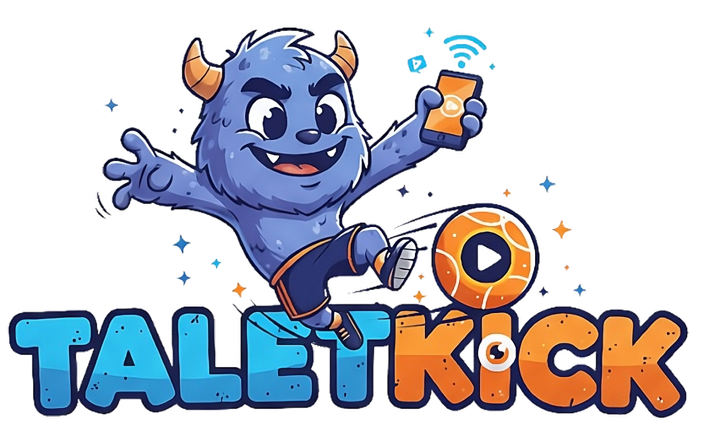
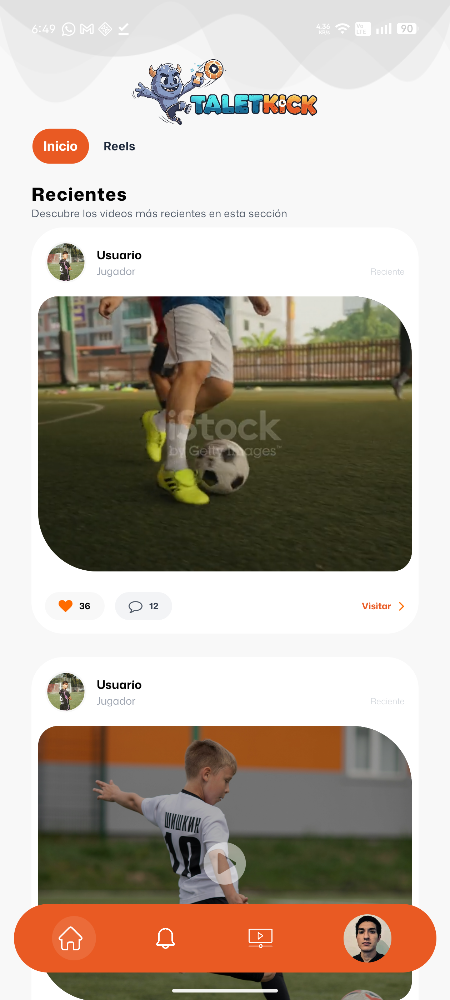
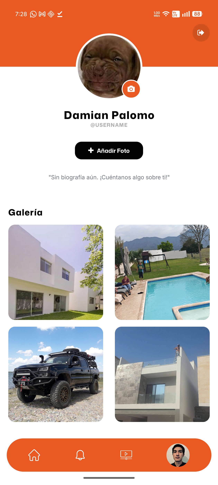
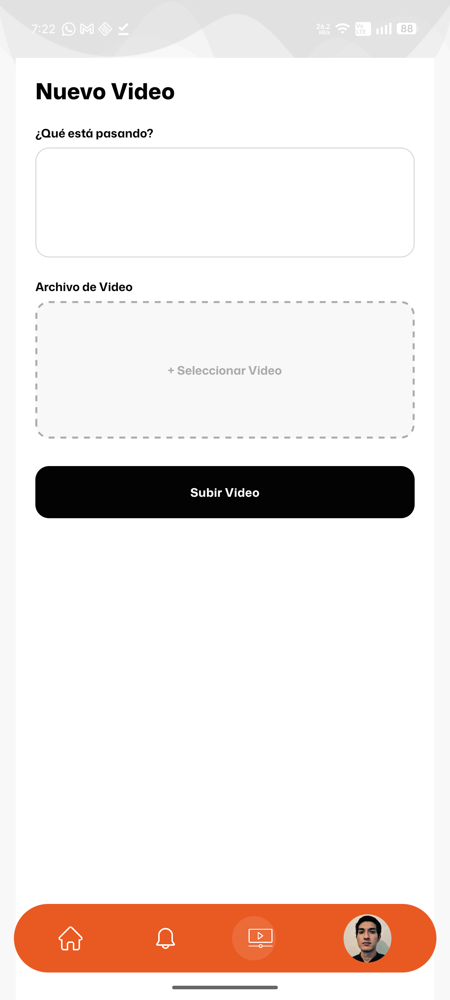
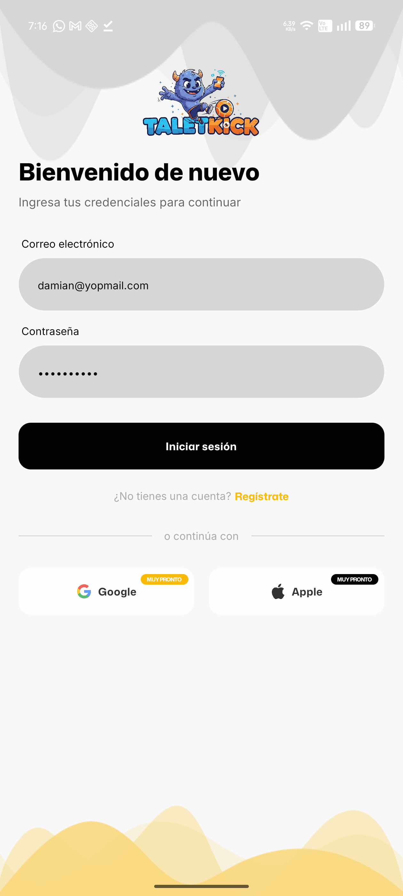

# 🚀 TalentKick

<p align="center">
  
</p>

**TalentKick** es una plataforma móvil diseñada para que atletas y talentos deportivos compartan su potencial a través de clips de video y conecten con una comunidad global.

## 📱 Capturas de Pantalla

| Home | Perfil | Nuevo Video |
| :---: | :---: | :---: |
|  |  |  |

| Login | Registro |
| :---: | :---: |
|  |  |


## 🛠️ Stack Tecnológico

La aplicación utiliza tecnologías de vanguardia para asegurar escalabilidad y rendimiento:

*   **Core**: [React Native](https://reactnative.dev/) (iOS & Android)
*   **Lenguaje**: [TypeScript](https://www.typescriptlang.org/)
*   **Gestión de Estado**: [Zustand](https://github.com/pmndrs/zustand)
*   **Estilos**: [NativeWind](https://www.nativewind.dev/) (Tailwind CSS para React Native)
*   **Multimedia**: [React Native Video](https://github.com/react-native-video/react-native-video) con optimización de buffer.
*   **Arquitectura**: Clean Architecture (Capa de Dominio, Infraestructura y Presentación).

---

## 🏗️ Arquitectura de Software

TalentKick sigue los principios de **Clean Architecture**, permitiendo un desacoplamiento total entre la lógica de negocio y los detalles técnicos:

*   **Dominio**: Entidades puras y casos de uso.
*   **Infraestructura**: Repositorios, clientes de API y mappers.
*   **Presentación**: Componentes atómicos, hooks personalizados y gestión de estado reactivo.

---

## 🚀 Empezando (Guía de Desarrollo)

### Requisitos Previos
Asegúrate de tener configurado tu entorno de desarrollo de [React Native](https://reactnative.dev/docs/set-up-your-environment).

### Paso 1: Iniciar Metro
```sh
npm start
```

### Paso 2: Ejecutar Aplicación
```sh
# Para Android
npm run android

# Para iOS
cd ios && pod install && cd ..
npm run ios
```
---

## 📄 Licencia
Distribuido bajo la Licencia MIT. Ver `LICENSE` para más información.

---
© 2026 TalentKick - Potenciando el futuro del deporte.
